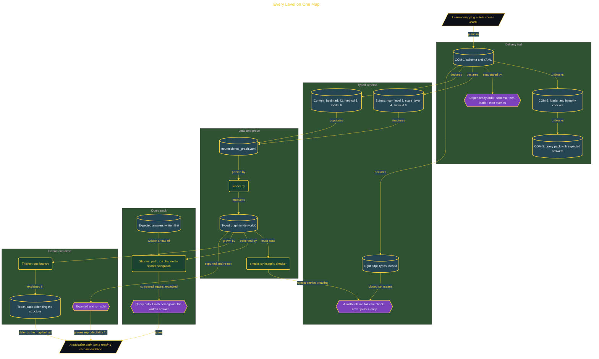

# Every Level on One Map

> Part of the [Computational Neuroscience](../../README.md) mastery track · *A route to command, one build at a time.*

## Overview

Neuroscience spans levels that rarely sit on the same page: ion channels, circuits, systems, behaviour. This build represents them as one typed, queryable concept graph loaded from YAML, so a question such as what the shortest path is from an ion channel to spatial navigation has a traceable answer instead of a reading recommendation. A reading list can describe those concepts; it cannot calculate the route between them.
The schema is fixed before any code interprets the data. Six node types carry the structure and the content: marr_level (3), scale_layer (4), and subfield (6) form the spines, while landmark (42), method (8), and model (6) hang the science on them. Eight edge types are allowed and no more: is-at-level, is-at-scale, belongs-to, underlies, explains, measured-by, inferred-from, and reproduced-by. The vocabulary is closed, so a spelling variation fails the integrity check rather than silently becoming a ninth edge type that no query knows about.
Work was split into three Linear tickets on dependency order, each on its own branch and pull request, because the schema had to exist before the loader could parse it and the loader had to work before queries could traverse anything. Expected answers were written before the queries ran, the graph was exported and run cold, and the build closed by thickening one branch and writing the teach-back that has to defend the structure rather than describe it.

## Architecture

The diagram shows the topology and data flow of the system as built. The full architectural narrative, with screenshots and prose, lives in [`documents/every-level-on-one-map.md`](./documents/every-level-on-one-map.md).

## Implementation

This system is built across **7 phases**:

1. The Vision: Building a Queryable Map of Neuroscience
2. Laying the Foundation: Environment, Repository, and Project Board
3. Designing the Schema: Six Node Types and a Closed Edge Vocabulary
4. Proving the Graph Sound: Loader and Integrity Checker
5. Querying the Graph: Expected Answers Written Before Running
6. Exporting, Running Cold, and Shipping Documentation
7. Extending the Graph: Thickening a Branch and Writing the Teach-Back

For the full walkthrough with screenshots and step-by-step content, see [`documents/every-level-on-one-map.md`](./documents/every-level-on-one-map.md).

## Validation

Each build phase below is documented in [`documents/every-level-on-one-map.md`](./documents/every-level-on-one-map.md), with screenshots, configuration, and notes as captured during the build:

- ✅ The Vision: Building a Queryable Map of Neuroscience
- ✅ Laying the Foundation: Environment, Repository, and Project Board
- ✅ Designing the Schema: Six Node Types and a Closed Edge Vocabulary
- ✅ Proving the Graph Sound: Loader and Integrity Checker
- ✅ Querying the Graph: Expected Answers Written Before Running
- ✅ Exporting, Running Cold, and Shipping Documentation
- ✅ Extending the Graph: Thickening a Branch and Writing the Teach-Back
